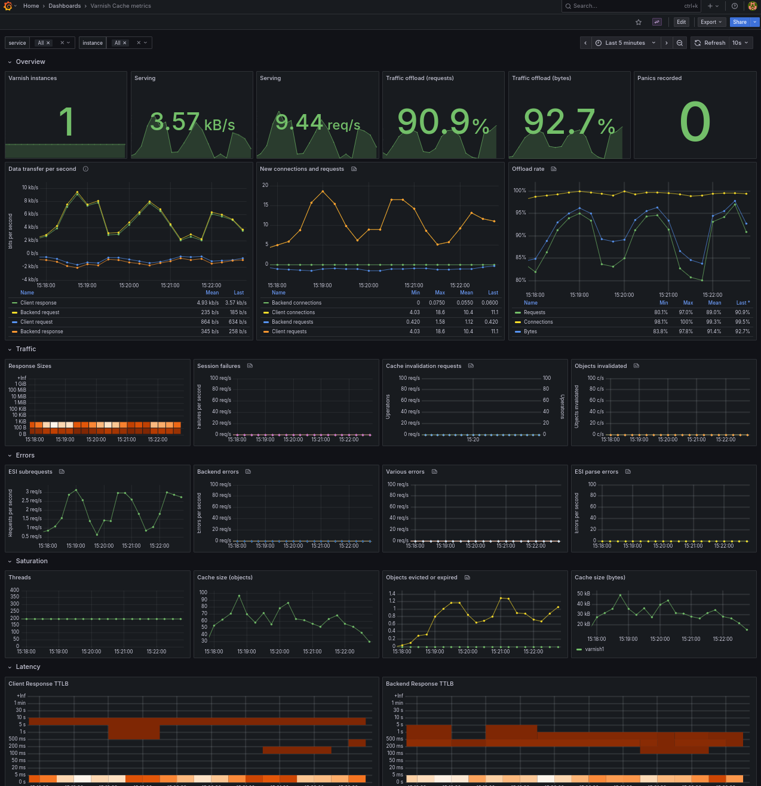
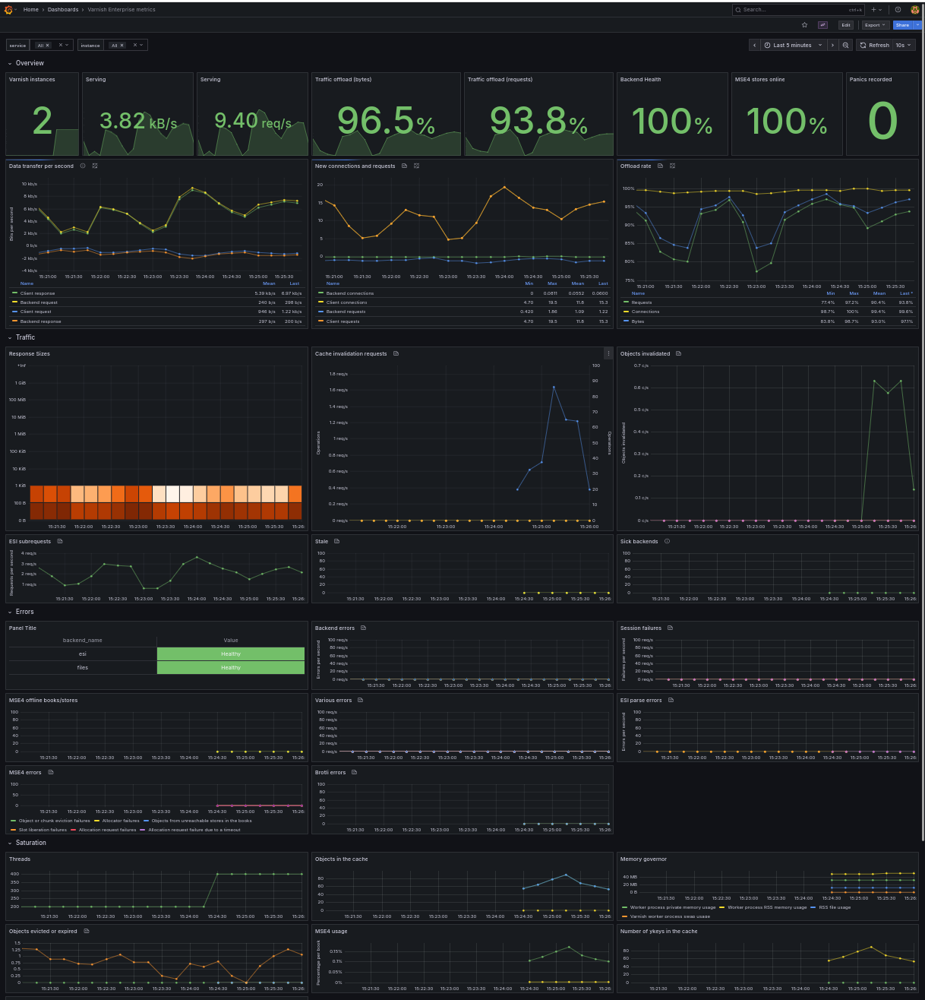

For Varnish Cache, use [`varnish_metrics.json`](../../docker-compose-examples/grafana-monitoring-otel/conf/grafana/provisioning/dashboards/varnish_metrics.json):

For Varnish Enterprise, use [`varnish_metrics.json`](../../docker-compose-examples/grafana-monitoring-otel/conf/grafana/provisioning/dashboards/varnish_metrics_plus.json):

