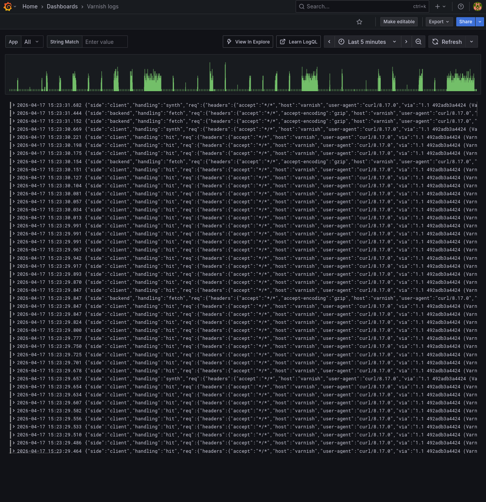
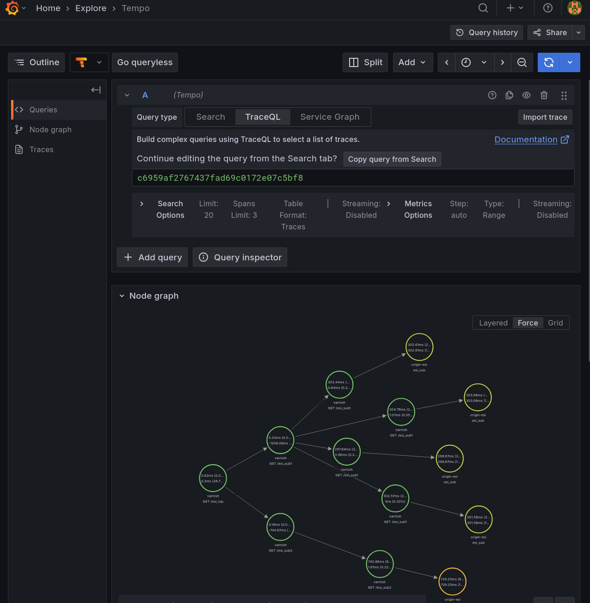
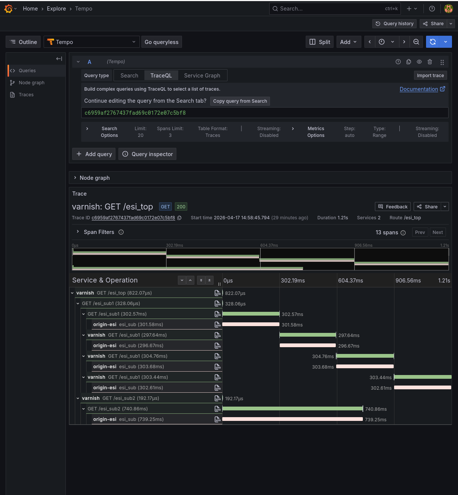
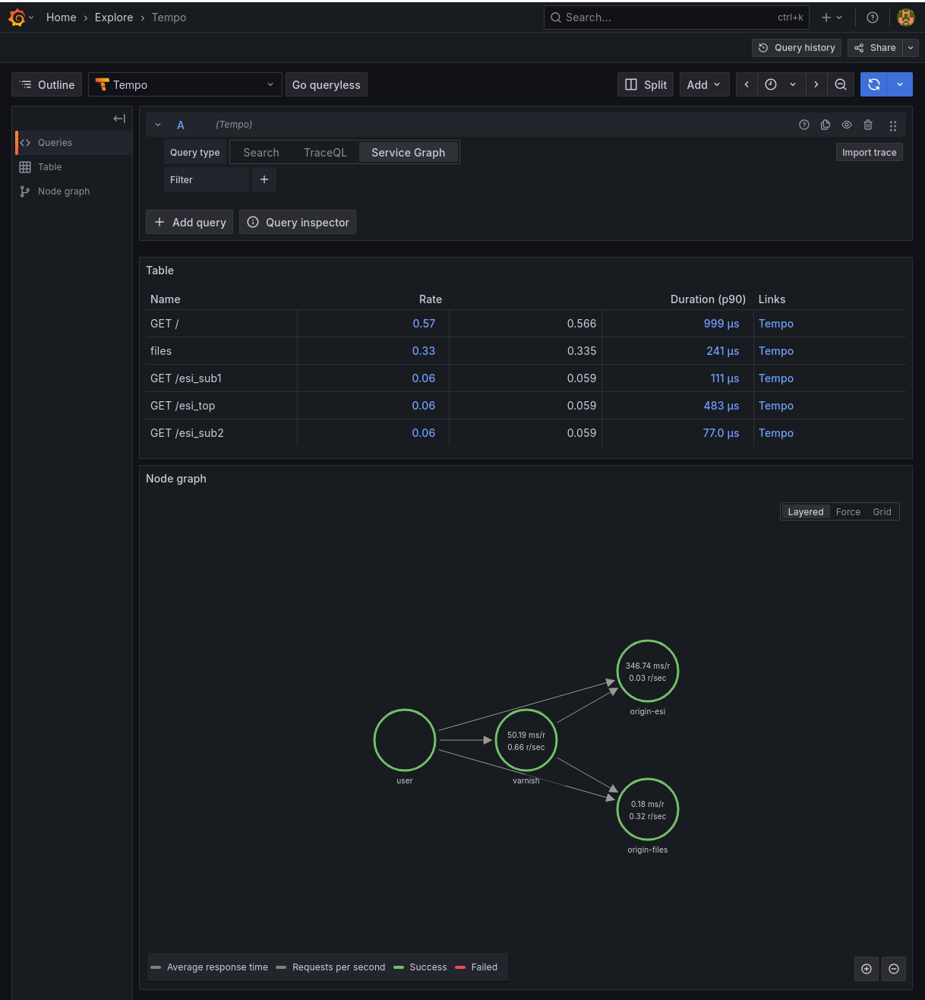

This is a port of the [grafana-monitoring directory](../grafana-monitoring) using `varnish-otel` as a single [otlp](https://opentelemetry.io/docs/specs/otel/protocol/) exporter to the various `grafana` tools.
Using `opentelemetry` simplifies the process quite a bit and notably introduces tracing (if using Varnish Enterprise).

# Getting started

## Varnish Cache

- run "docker compose up -d"
- go to http://localhost:3000
- login with `admin:password`

You should see the main dashboard, and you can also use the `Explore` tab to discover more metrics, or check the `Varnish logs` dashboard.

 

## Varnish Enterprise

- place the license file ( `varnish-enterprise.lic`, you can ask for one [here](https://www.varnish-software.com/contact-us/)) in `conf/`. The license should enable both `vmod-otel` and `mse4`.
- run "docker compose up -d -f compose-plus.yaml"
- go to http://localhost:3000
- login with `admin:password`

As for the Cache option, you will land on the main dashboard, but you should check the `Varnish Enterprise Metrics` dashboard which offer more in-depth metrics and support for backend health.

 
 

The `Explore` tab will allow you to check on `Tempo` and traces, notably the service graph that gets generated automatically by the traces.
