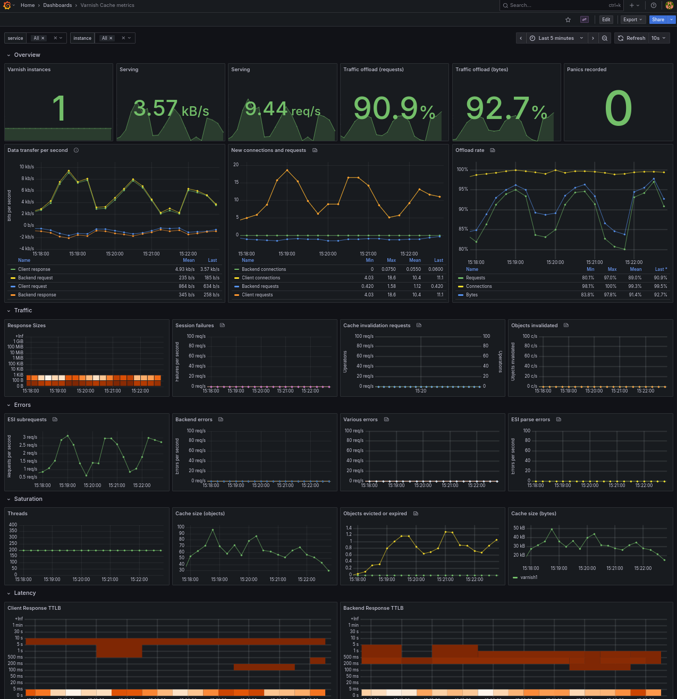
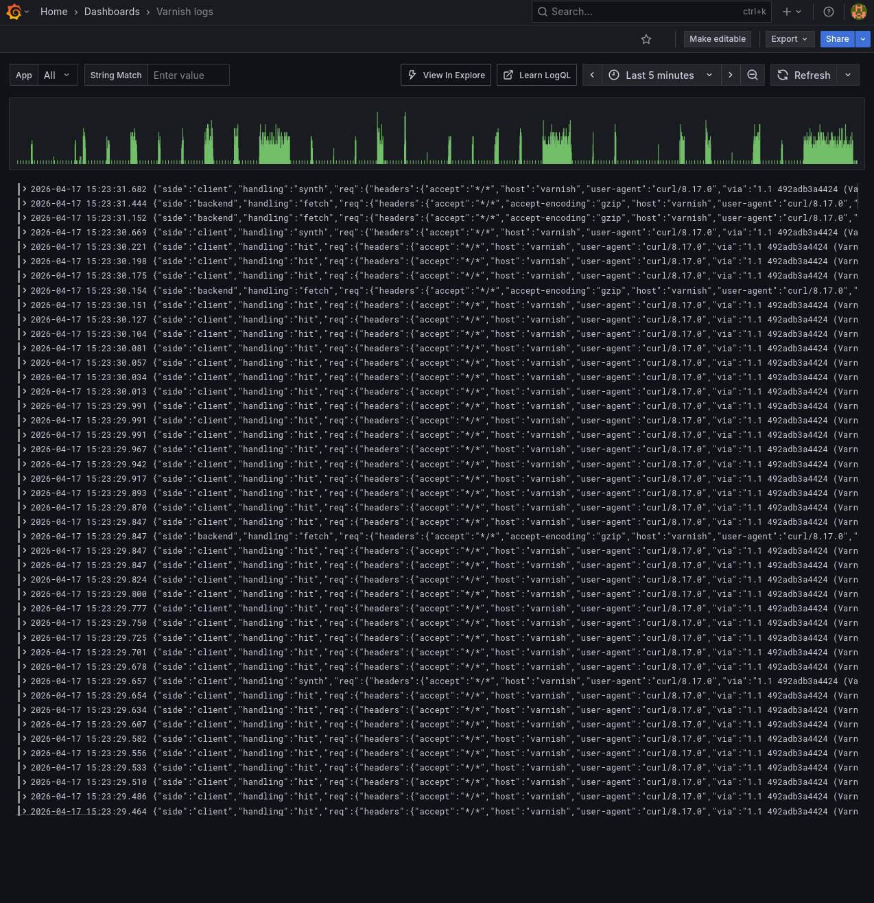
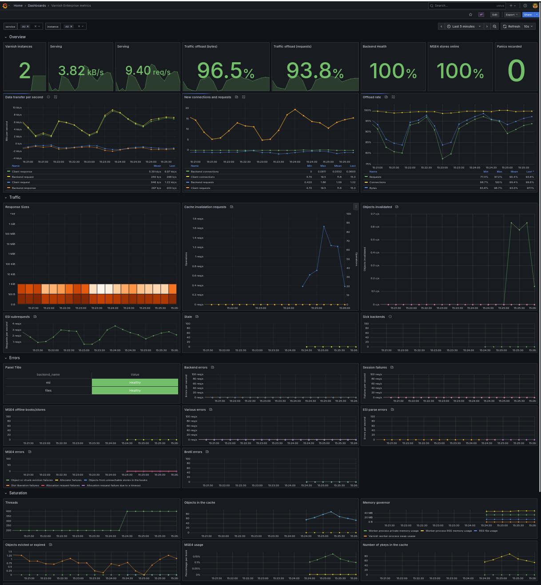
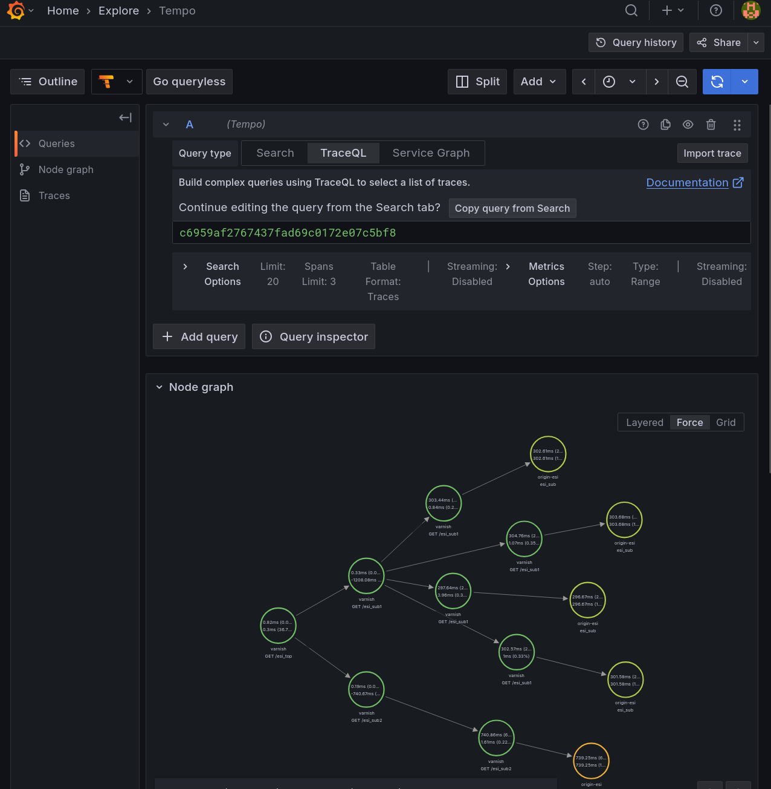
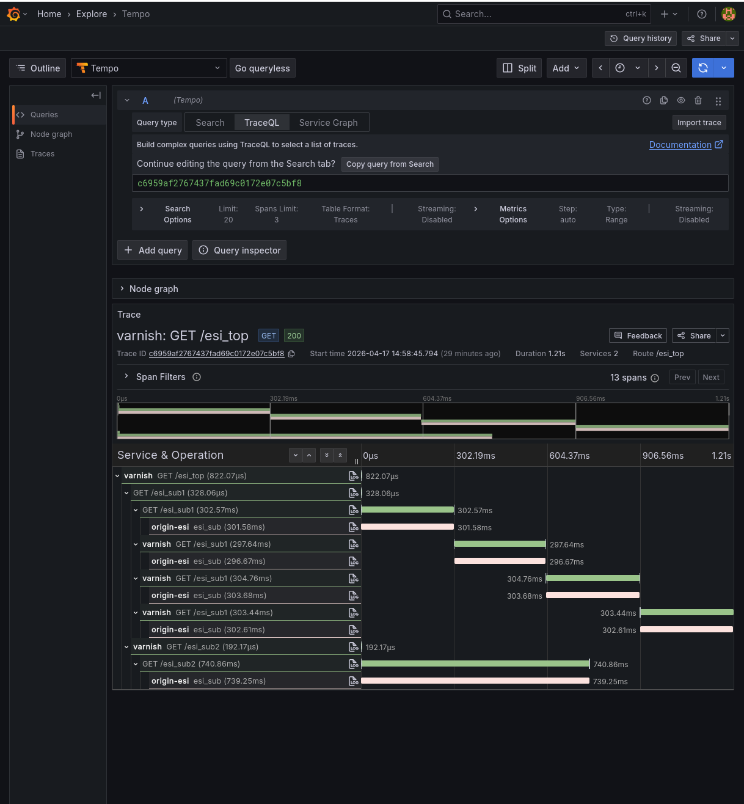
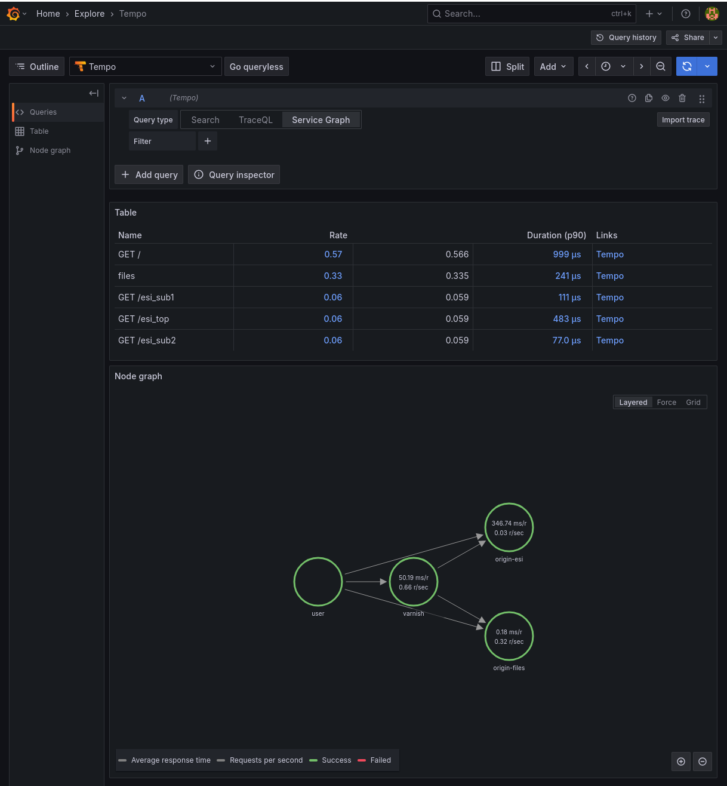

This is a port of the [grafana-monitoring directory](../grafana-monitoring) using `varnish-otel` as a single [otlp](https://opentelemetry.io/docs/specs/otel/protocol/) exporter to the various `grafana` tools.
Using `opentelemetry` simplifies the process quite a bit and notably introduces tracing (if using Varnish Enterprise).

# Getting started

## Standalone OpenTelemetry & Grafana setup

If you want to deploy a standalone OpenTelemetry stack you can point any OTLP-emitting workload at, simply run the following command:

```sh
docker compose up -d
```

To tear down the environment, run the following command:

```sh
docker compose down -v
```

### Accessing Grafana

Once the containers are healthy, open Grafana at [http://localhost:3000](http://localhost:3000). No credentials are needed, and anonymous access is granted with admin privileges. The Prometheus, Loki and Tempo datasources are already configured under **Connections → Data sources**, and you can use the **Explore** tab to query each backend.

### Sending telemetry data

The following ports are published to the Docker host:

| Service        | Endpoint                                                       | Purpose                  |
| -------------- | -------------------------------------------------------------- | ------------------------ |
| Grafana        | [http://localhost:3000](http://localhost:3000)                 | UI                       |
| OTel Collector | [http://localhost:4318](http://localhost:4318)                 | OTLP/HTTP receiver       |
| OTel Collector | `localhost:4317`                                               | OTLP/gRPC receiver       |
| OTel Collector | [http://localhost:8888/metrics](http://localhost:8888/metrics) | Collector self-metrics   |
| Prometheus     | [http://localhost:9090](http://localhost:9090)                 | Prometheus UI / API      |
| Loki           | [http://localhost:3100](http://localhost:3100)                 | Loki HTTP API            |
| Tempo          | [http://localhost:3200](http://localhost:3200)                 | Tempo HTTP API           |

You can send telemetry data to the specific services (Prometheus, Loki & Tempo) by defining the individual `OTEL_EXPORTER_OTLP_METRICS_ENDPOINT`, `OTEL_EXPORTER_OTLP_LOGS_ENDPOINT` & `OTEL_EXPORTER_OTLP_TRACES_ENDPOINT` environment variables.

However, there's also an OTel Collector service that captures the different types of telemetry data and forwards that data to the corresponding service (Prometheus, Loki & Tempo). It only requires a single OTLP endpoint and can simply by configured through the `OTEL_EXPORTER_OTLP_ENDPOINT` environment variable.

#### From a Docker container on the same compose network

Within this compose network, services can address each other by container name on the internal ports:

- `http://otel-collector:4318` (OTLP/HTTP)
- `otel-collector:4317` (OTLP/gRPC)
- `http://grafana:3000`
- `http://prometheus:9090`
- `http://loki:3100`
- `http://tempo:3200`


Here's an example:

```sh
export OTEL_EXPORTER_OTLP_ENDPOINT=http://otel-collector:4318
export OTEL_EXPORTER_OTLP_PROTOCOL=http/protobuf
```

#### From your host system

If you're sending telemetry data from your host system, the port forwarding ensures the exposed services are available via `localhost`.

Here's an example:

```sh
export OTEL_EXPORTER_OTLP_ENDPOINT=http://localhost:4318
export OTEL_EXPORTER_OTLP_PROTOCOL=http/protobuf
```

#### From another Docker container

If your workload runs in a container that is not part of this compose project (for example, a separate `docker compose` stack or a one-off `docker run`), it cannot resolve `otel-collector` or use `localhost:4318` directly.

Use `host.docker.internal` to reach the published ports on the host:

```sh
export OTEL_EXPORTER_OTLP_ENDPOINT=http://host.docker.internal:4318
export OTEL_EXPORTER_OTLP_PROTOCOL=http/protobuf
```

## Varnish Cache

If you want to use this OpenTelemetry stack in conjunction with Varnish and automatically generate telemetry data, run the following command:

```sh
docker compose --profile varnish up -d
```

The `load_generator` service will automatically send traffic to Varnish, which means logs, metrics and traces will be available in Grafana.

You can access Grafana on [http://localhost:3000](http://localhost:3000) without the need for any credentials. You should see the main dashboard, and you can also use the `Explore` tab to discover more metrics, or check the `Varnish logs` dashboard.

 

To tear down the environment, run the following command:

```sh
docker compose --profile varnish down -v
```

## Varnish Enterprise

If you want to use the OpenTelemetry stack with Varnish Enterprise instead, follow these instructions:

- Place the license file ( `varnish-enterprise.lic`, you can ask for one [here](https://www.varnish-software.com/contact-us/)) in `conf/`. The license should enable both `vmod-otel` and `mse4`.
- Run `docker compose -f compose-enterprise.yaml --profile varnish up -d`
- Access Grafana via [http://localhost:3000](http://localhost:3000)

As for the Cache option, you will land on the main dashboard, but you should check the `Varnish Enterprise Metrics` dashboard which offer more in-depth metrics and support for backend health.

 
 

The `Explore` tab will allow you to check on `Tempo` and traces, notably the service graph that gets generated automatically by the traces.

To tear down the environment, run the following command:

```sh
docker compose --profile varnish down -v
```